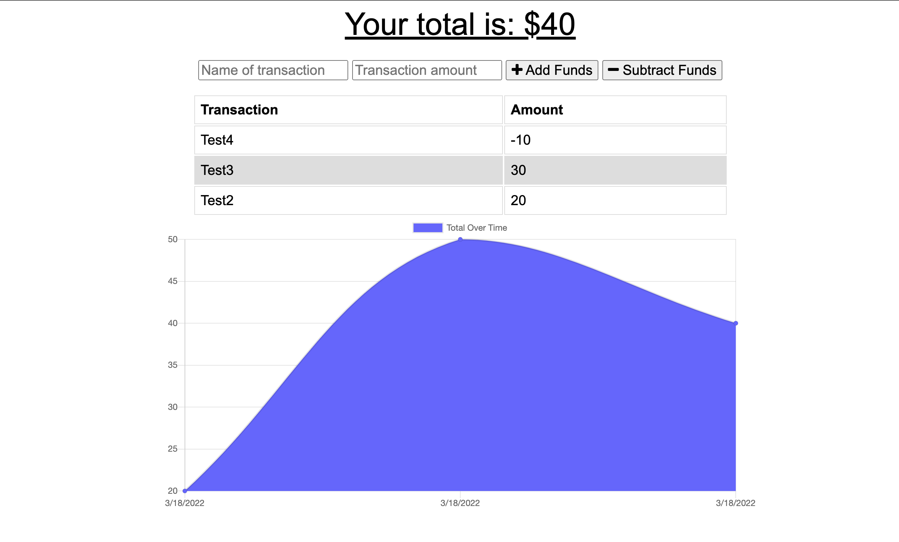

# Budget Tracker
  
  

## Summary

Updated an existing budget tracker application to allow for offline access and functionality. The user will be able to add expenses and deposits to their budget with or without a connection. If the user enters transactions offline, the total is updated when they're brought back online.

## Deployment
https://still-plains-23937.herokuapp.com/ 
## Screenshot

## Questions
  If you have any questions about this project, please open an issue or use the contact information below:
  * [katiechurchwell](https://www.github.com/katiechurchwell)
  * [churchwellcatherine@gmail.com](mailto:churchwellcatherine@gmail.com)

---
  